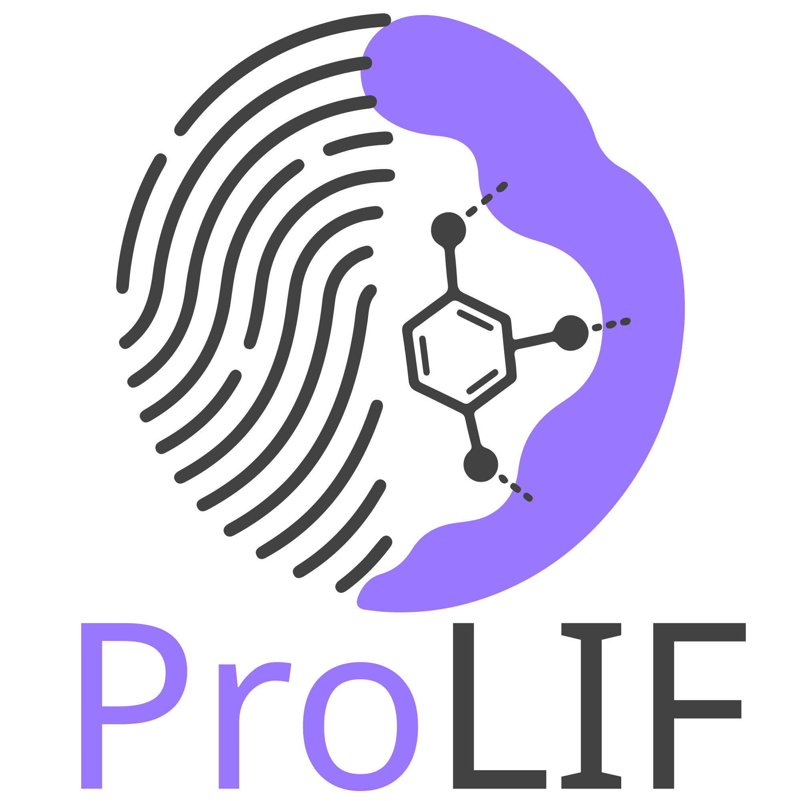
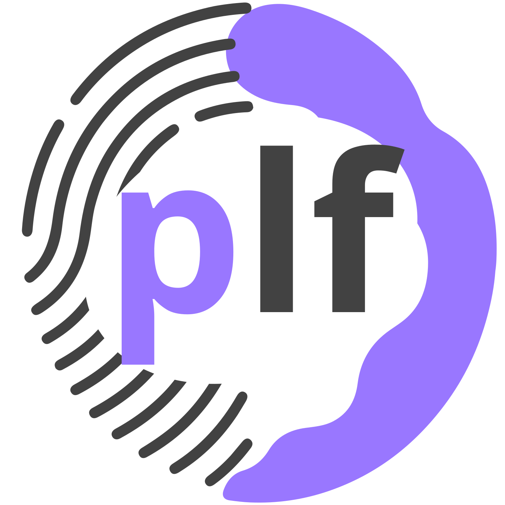

Citation
--------

If you use ProLIF in your research, please cite the following `paper <https://doi.org/10.1186/s13321-021-00548-6>`_:

.. code-block:: text

   Bouysset, C., Fiorucci, S. ProLIF: a library to encode molecular interactions as fingerprints.
   J Cheminform 13, 72 (2021). https://doi.org/10.1186/s13321-021-00548-6

You can additionally cite the DOI corresponding to the release version you've used by
visiting the `Zenodo page <https://zenodo.org/search?page=1&size=20&q=conceptrecid:%224386984%22&sort=-version&all_versions=True>`_.

Logo
----

   The ProLIF logo was created by `Anton Siomchen <https://github.com/asiomchen>`_ and
   is licensed under a `CC BY 4.0 License <https://creativecommons.org/licenses/by/4.0/>`_.

   The ProLIF favicon was created by `Cedric Bouysset <https://github.com/cbouy>`_ based
   on the logo design from Anton Siomchen and uses the same license.