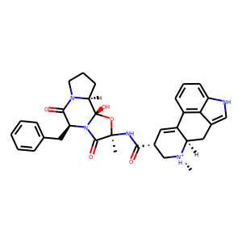

Quickstart
==========

This is a very short guide on how to use ProLIF to generate an interaction fingerprint for a ligand-protein complex.
For more in-depth tutorials, please refer to the :ref:`source/examples:Examples` section.

Let's start by importing MDAnalysis and ProLIF to read our input files:

    .. ipython:: python

        import MDAnalysis as mda
        import prolif as plf
        # load trajectory
        u = mda.Universe(plf.datafiles.TOP, plf.datafiles.TRAJ)
        # create selections for the ligand and protein
        lig = u.atoms.select_atoms("resname LIG")
        prot = u.atoms.select_atoms("protein")
        lig, prot

MDAnalysis should automatically recognize the file type that you're using from its extension. Click `here <https://userguide.mdanalysis.org/stable/quickstart.html>`_ to learn more about loading files with MDAnalysis, and `here <https://userguide.mdanalysis.org/stable/selections.html>`_ to learn more about their atom selection language.

Next, lets make sure that our ligand was correctly read by MDAnalysis. 

.. warning:: The next step is crucial if you're loading a structure from a file that doesn't explicitely contain bond orders and formal charges. MDAnalysis will infer those from the atoms connectivity, which requires all atoms including hydrogens to be present in the input file.

ProLIF molecules are built on top of RDKit and are compatible with its drawing code. Let's have a quick look at our ligand:

    .. ipython:: python

        from rdkit import Chem
        from rdkit.Chem import Draw
        # create a molecule from the MDAnalysis selection
        lmol = plf.Molecule.from_mda(lig)
        # cleanup before drawing
        mol = Chem.RemoveHs(lmol)
        mol.RemoveAllConformers()
        Draw.MolToImage(mol)

Everything looks good, we can now compute a fingerprint:

    .. ipython:: python

        fp = plf.Fingerprint()
        # run on one frame every ten frames
        fp.run(u.trajectory[::10], lig, prot)
        df = fp.to_dataframe()
        df.T.head(10)

The results are available as a Pandas DataFrame which is usually more convenient to use than nested lists/dictionnaries. Click `here <https://pandas.pydata.org/docs/user_guide/10min.html>`_ for a quick guide. You can export the results with::

    df.to_csv("interaction_fingerprint.csv")

To keep the output short, the resulting DataFrame only keeps track of residues and interaction types that were seen in at least one of the frames in your trajectory. The full results are still available in ``fp.ifp`` as a list of dictionnaries (one for each trajectory frame).

You can also compute a Tanimoto similarity between each frames:

    .. ipython:: python

        from rdkit import DataStructs
        bvs = fp.to_bitvectors()
        tanimoto_sims = DataStructs.BulkTanimotoSimilarity(bvs[0], bvs)
        tanimoto_sims[1]